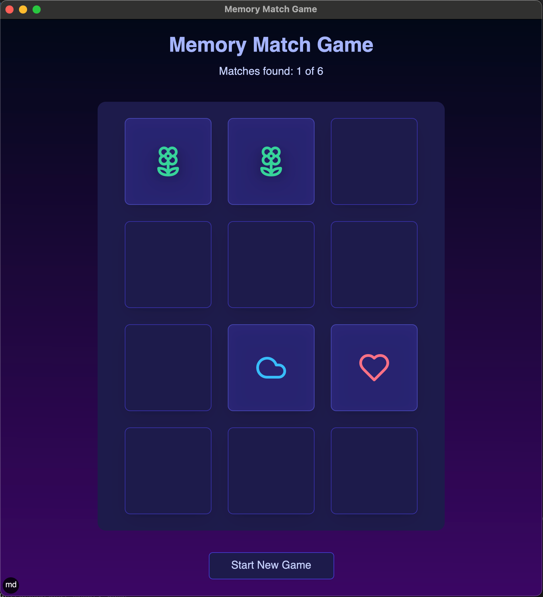

# Memory Match Game

A copy of
[kids-memory-game](https://v0.dev/chat/community/kids-memory-game-Tmi0y0iPzxv)
built with Rust and gpui.

## Executable Sizes

| Plateform        | Size(M) |
| ---------------- | ------: |
| MacOS (aarch64)  |     2.4 |
| MacOS (x86_64)   |     2.9 |
| Windows (x86_64) |     4.8 |
| Linux (aarch64)  |     3.9 |
| Linux (x86_64)   |     4.8 |

## Installer Sizes

| Plateform                  | Size(M) |
| -------------------------- | ------: |
| MacOS (aarch64.dmg)        |    1.26 |
| MacOS (x86_64.dmg)         |    1.33 |
| Windows (x86_64-setup.exe) |    2.95 |
| Linux (aarch64.deb)        |    1.90 |
| Linux (x86_64.deb)         |    1.99 |
| Linux (aarch64.AppImage)   |    2.11 |
| Linux (x86_64.AppImage)    |    2.20 |
| Linux (aarch64.tar.gz)     |    1.90 |
| Linux (x86_64.tar.gz)      |    1.99 |
